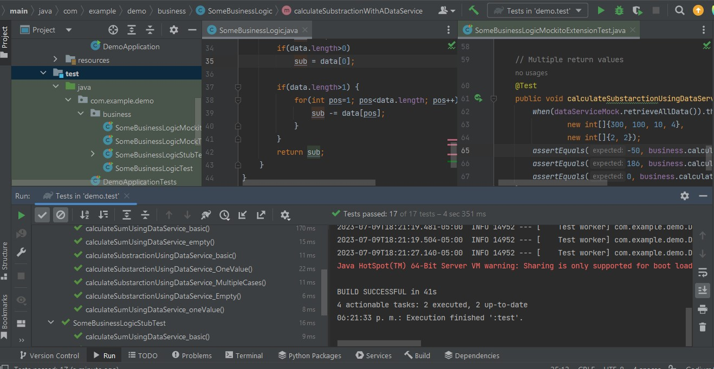

# Testing with Stubs and Mockito Framework

[Previous activities: Session 5](https://github.com/beduExpert/Java-Testing-Santander-2022/tree/main/Sesion-05)

## 🎯 OBJECTIVES

- Add subtraction functionality to the SomeBusinessLogic class.
- Add tests with mock injection.
- Get familiar with Mockito tools.

## 🚀 DEVELOPMENT

During our work, we developed some functionalities in the SomeBusinessLogic class and started getting familiar with the use of Mockito. Now, in this post work, we will continue the development of this class and explore some Mockito functionalities by completing the following exercise:

- Add subtraction functionality to the SomeBusinessLogic class.
- The method should utilize SomeDataService.
- We should test at least 3 cases: with an array of multiple numbers, with an empty array, and with an array of a single number.
- Implement mocks with multiple return values: More information: [https://dev.to/srinivasu619/mockito-returning-a-different-value-for-the-same-function-invocation-434c](https://dev.to/srinivasu619/mockito-returning-a-different-value-for-the-same-function-invocation-434c)
- Explore the possibilities of using mocks that return specific values based on the parameters they receive.

Follow these instructions:

1. In the SomeBusinessLogic.java file, add a function called calculateSubstractionWithADataService.
2. Base its implementation on what was done with calculateSumWithADataService.
3. In the SomeBusinessLogicMockTest.java file, create three methods with the following names: calculateSubstractionUsingDataService_basic, calculateSubstractionUsingDataService_empty, and calculateSubstracionUsingDataService_oneValue.
4. Implement mocks with multiple return values: More information: [https://dev.to/srinivasu619/mockito-returning-a-different-value-for-the-same-function-invocation-434c](https://dev.to/srinivasu619/mockito-returning-a-different-value-for-the-same-function-invocation-434c)

### General instructions

Did you finish the activity? Answer the following questions:

How did you decide to inject the mock?

    Using the following annotations:
    
    - @ExtendWith(MockitoExtension.class) in the test class
    - @InjectMocks on the SomeBusinessLogic object
    - @Mock on the SomeDataService object

Did you implement a single test method with multiple return values or did you implement multiple tests? Why?

    Both methods were implemented, to identify different approaches and choose the most convenient one depending on the case.
    A test class was added to record both approaches: SomeBusinessLogicMockitoExtensionTest.java.

Do you think there is a difference between manually injected mocks and mocks injected with Mockito? What are the differences?

    Yes, there is a difference. Manually injected mocks would be instances of the real objects and require the developer to write more code for their configuration, which implies that the developer also has more control over the mock object.
    On the other hand, Mockito framework dynamically creates the mock object based on the indicated class and automates a large part of the tasks, making it easier to define behaviors in the mock objects.

### Project screen capture

[Link back to main repository](https://github.com/adavals/bedu-webjava-f3m2)